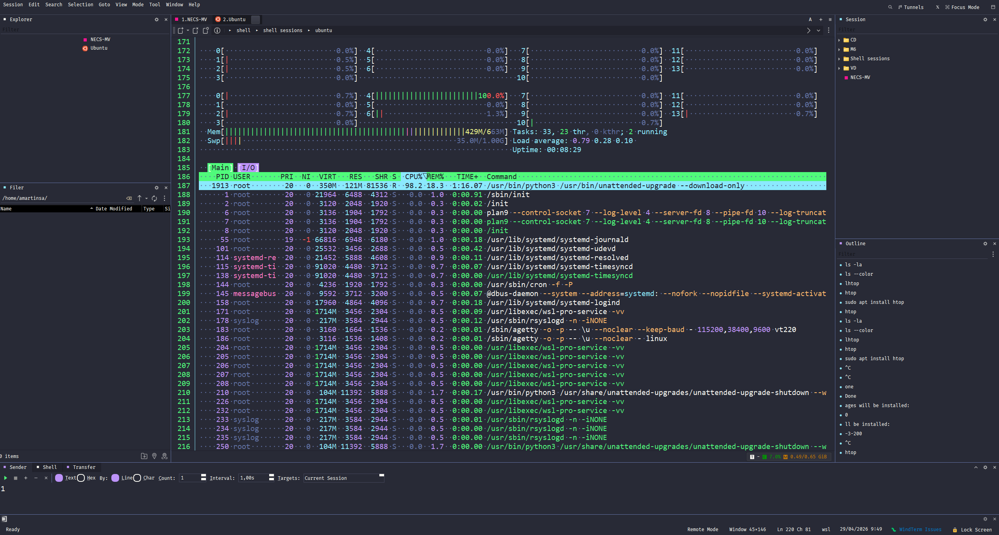
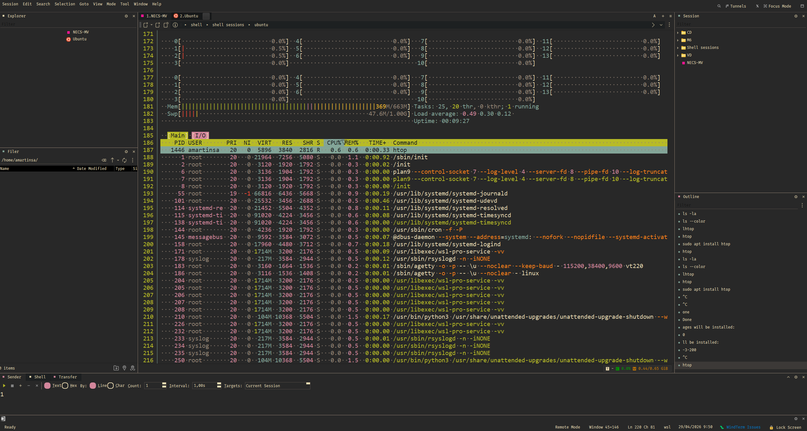
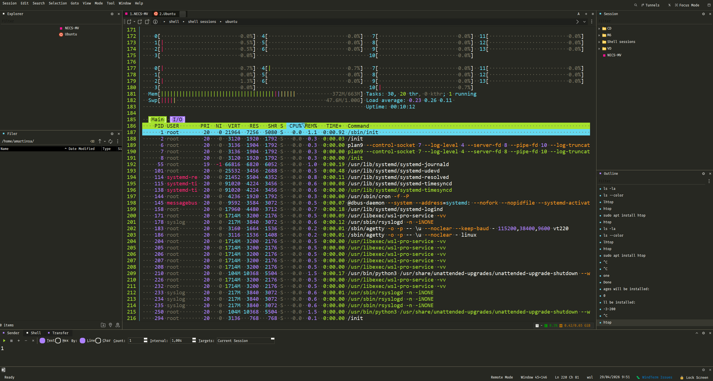
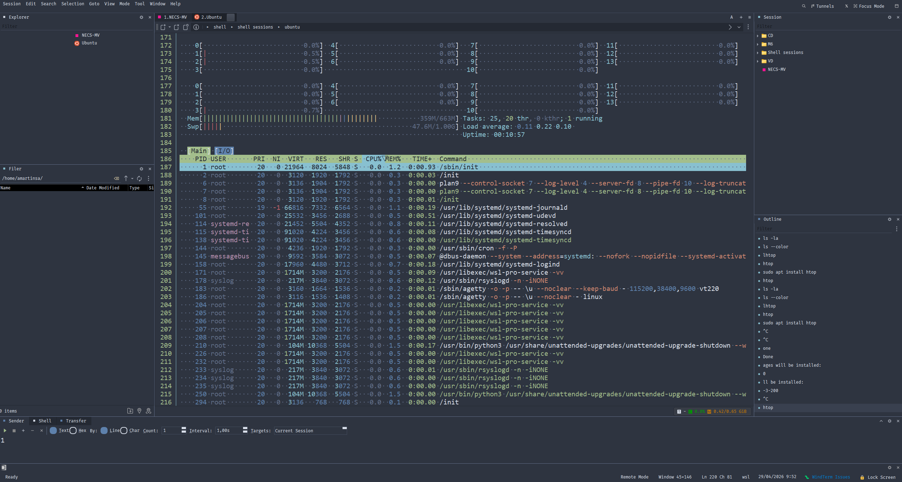
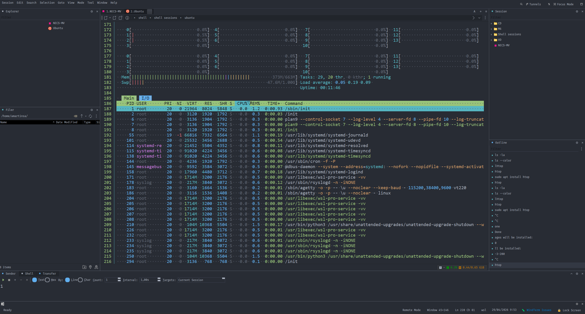
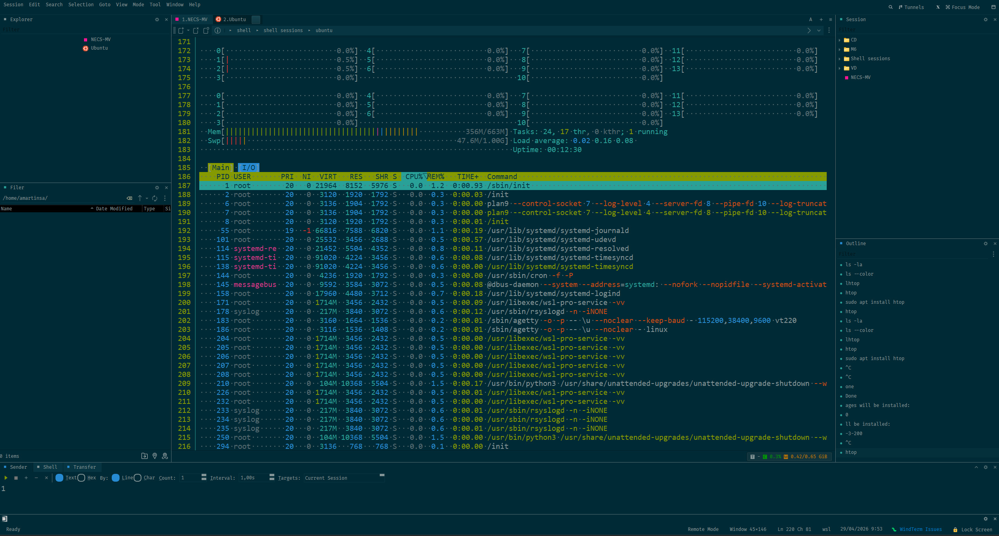
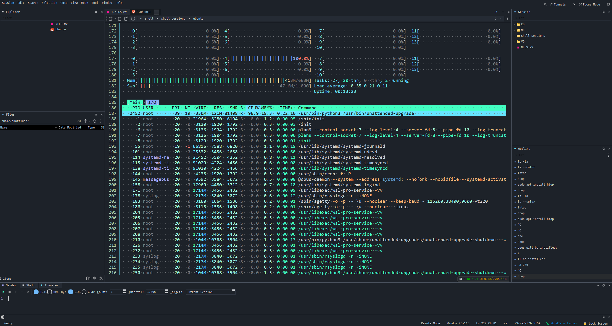
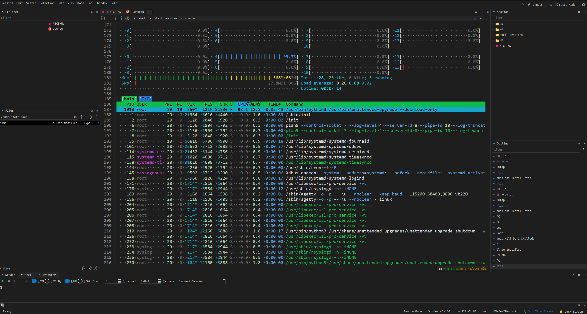

# WindTerm Themes

A curated collection of custom visual themes for the [WindTerm](https://github.com/kingToolbox/WindTerm) terminal emulator.

## Prerequisites

- [WindTerm](https://github.com/kingToolbox/WindTerm) installed on your system.

## Installation

1. Download or clone the desired theme folder from this repository.
2. Copy the theme folder (e.g., `dracula`, `monokai`) into your WindTerm **installation directory** under the `global\themes\` path:
   - **Windows:** `<WindTermInstallDir>\global\themes\`
   - **macOS/Linux:** `<WindTermInstallDir>/global/themes/`
3. Restart WindTerm if it is already running.
4. Open **Session Preferences** → **Appearance** → **Theme** and select the newly installed theme from the list.

> **Note:** Each theme folder contains `gui.theme`, `icon.theme`, and `scheme.theme` files required by WindTerm. Ensure all three files are present in the copied folder.

## Available Themes

| Theme | Preview | Files |
|-------|---------|-------|
| [Dracula](./dracula/) |  | `gui.theme`, `icon.theme`, `scheme.theme` |
| [Gruvbox Dark](./gruvbox-dark/) |  | `gui.theme`, `icon.theme`, `scheme.theme` |
| [Monokai](./monokai/) |  | `gui.theme`, `icon.theme`, `scheme.theme` |
| [Nord](./nord/) |  | `gui.theme`, `icon.theme`, `scheme.theme` |
| [One Dark](./one-dark/) |  | `gui.theme`, `icon.theme`, `scheme.theme` |
| [Solarized Dark](./solarized-dark/) |  | `gui.theme`, `icon.theme`, `scheme.theme` |
| [True Godot](./true-godot/) |  | `gui.theme`, `icon.theme`, `scheme.theme` |
| [VS Code Dark](./vscode-dark/) |  | `gui.theme`, `icon.theme`, `scheme.theme` |

---

*Want to contribute a new WindTerm theme? Follow the file structure above and open a pull request.*
